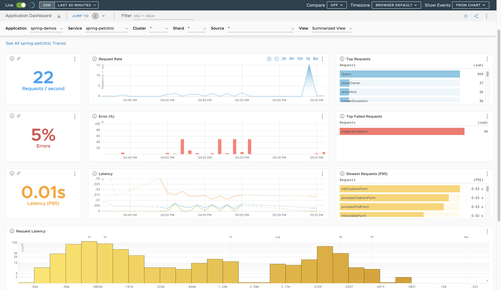
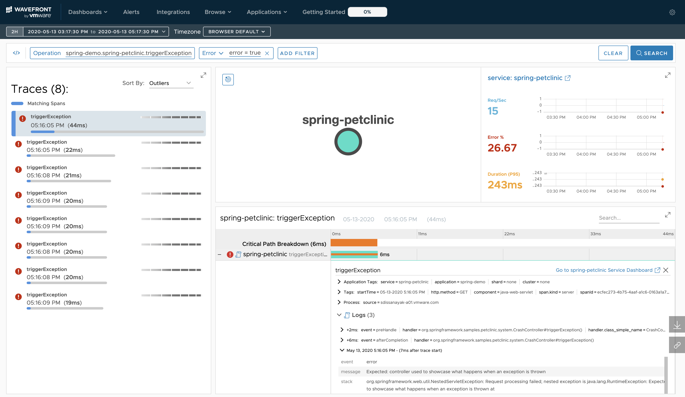

ifdef::env-github[]
:tip-caption: :bulb:
:note-caption: :information_source:
:important-caption: :heavy_exclamation_mark:
:caution-caption: :fire:
:warning-caption: :warning:
endif::[]

= Using Tanzu Observability

== Overview

[.lead]
In this lab we'll utilize Tanzu Observability (TO) to visualize metrics being produced by the Spring Boot application.  This includes metrics such as jvm memory usage as well distributed tracing.

In order to demonstrate this functionality we will be using the application provided.

This application has two components:  A frontend,  and a backend.  The front end application calls the back end application and reports back its execution time.

The demo application is located within the lab08 subdirectory.
[source.bash]
----
cd labs/lab08/spring-resillience4j
----

== Start the Demo Application

. Open two terminal windows and run the application using the following command.
[source.bash]
+
----
./mvnw spring-boot:run  -Dspring-boot.run.profiles=backend
----
+
and
+
[source.bash]
----
./mvnw spring-boot:run  -Dspring-boot.run.profiles=frontend
----
+
. Open your browser and visit
+
[source]
----
http://localhost:8080/frontend
----
You should see something similar to this.
+
[source.json]
----
{"fallback":false,"totalTime":97,"backendWait":91,"backendDate":"2021-07-23T13:33:14.499+00:00"}
----
* `fallback` indicates if the circuit breaker is open or closed.
* `backendWait` indicates time spent waiting on the backend
* `totalTime` indicates the total execution time including the backendWait.

. Break the Application
+
The backend application uses a random time interval to sleep before returning a result.  You can increase the threshold of this time interval using the following command.
+
[source.bash]
----
curl http://localhost:9090/backend/maxwait/100000
----
+
Visiting the front end application should now result in the `fallback` tag showing true.
+
You can fix the app by reseting the maxwait to the default value.
+
[source.bash]
----
curl http://localhost:9090/backend/maxwait/100
----

== Add the TO Dependency

. Spring Boot TO integration is enabled by adding the following dependency to your maven pom.
+
.spring-resilience4j/pom.xml
[source,xml]
----
	<dependency>
        <groupId>com.wavefront</groupId>
        <artifactId>wavefront-spring-boot-starter</artifactId>
	</dependency>
----
+
. Add the Wavefront Bill of Materials to the pom's dependency management section.
+
.spring-resilience4j/pom.xml
[source,xml]
----
<dependency>
    <groupId>com.wavefront</groupId>
    <artifactId>wavefront-spring-boot-bom</artifactId>
    <version>2.1.1</version>
    <type>pom</type>
    <scope>import</scope>
</dependency>
----
. Add the Distributed tracing dependency
+
.spring-resilience4j/pom.xml
[source,xml]
----
<dependency>
    <groupId>org.springframework.cloud</groupId>
    <artifactId>spring-cloud-starter-sleuth</artifactId>
</dependency>
----
+
. add the following properties to the application-backend.yml
[source.yaml]
+
----
wavefront.application.name: demo
wavefront.application.service: back-end-app
----
+
. add the following properties to the application-frontend.yml
[source.yaml]
+
----
wavefront.application.name: demo
wavefront.application.service: front-end-app
----
+
It should look like this when you are done.
+
[source.xml]
----
<?xml version="1.0" encoding="UTF-8"?>
<project xmlns="http://maven.apache.org/POM/4.0.0" xmlns:xsi="http://www.w3.org/2001/XMLSchema-instance"
	xsi:schemaLocation="http://maven.apache.org/POM/4.0.0 https://maven.apache.org/xsd/maven-4.0.0.xsd">
	<modelVersion>4.0.0</modelVersion>
	<parent>
		<groupId>org.springframework.boot</groupId>
		<artifactId>spring-boot-starter-parent</artifactId>
		<version>2.4.9</version>
		<relativePath/> <!-- lookup parent from repository -->
	</parent>
	<groupId>com.vmware</groupId>
	<artifactId>resilience4j</artifactId>
	<version>0.0.1-SNAPSHOT</version>
	<name>resilience4j</name>
	<description>Demo project for Spring resilience4j</description>
	<properties>
		<java.version>11</java.version>
		<spring-cloud.version>2020.0.3</spring-cloud.version>
	</properties>
	<dependencies>
		<dependency>
			<groupId>org.springframework.boot</groupId>
			<artifactId>spring-boot-starter-actuator</artifactId>
		</dependency>
		<dependency>
			<groupId>org.springframework.boot</groupId>
			<artifactId>spring-boot-starter-web</artifactId>
		</dependency>
		<dependency>
			<groupId>com.wavefront</groupId>
			<artifactId>wavefront-spring-boot-starter</artifactId>
		</dependency>
		<dependency>
			<groupId>org.springframework.cloud</groupId>
			<artifactId>spring-cloud-starter-circuitbreaker-resilience4j</artifactId>
		</dependency>
		<dependency>
			<groupId>org.springframework.boot</groupId>
			<artifactId>spring-boot-starter-aop</artifactId>
		</dependency>
		<dependency>
			<groupId>io.micrometer</groupId>
			<artifactId>micrometer-registry-prometheus</artifactId>
			<scope>runtime</scope>
		</dependency>
		<dependency>
			<groupId>org.springframework.boot</groupId>
			<artifactId>spring-boot-starter-test</artifactId>
			<scope>test</scope>
		</dependency>
		<dependency>
			<groupId>org.springframework.cloud</groupId>
			<artifactId>spring-cloud-starter-sleuth</artifactId>
		</dependency>
	</dependencies>
	<dependencyManagement>
		<dependencies>
			<dependency>
				<groupId>org.springframework.cloud</groupId>
				<artifactId>spring-cloud-dependencies</artifactId>
				<version>${spring-cloud.version}</version>
				<type>pom</type>
				<scope>import</scope>
			</dependency>
			<dependency>
				<groupId>com.wavefront</groupId>
				<artifactId>wavefront-spring-boot-bom</artifactId>
				<version>2.1.1</version>
				<type>pom</type>
				<scope>import</scope>
			</dependency>
		</dependencies>
	</dependencyManagement>

	<build>
		<plugins>
			<plugin>
				<groupId>org.springframework.boot</groupId>
				<artifactId>spring-boot-maven-plugin</artifactId>
			</plugin>
		</plugins>
	</build>

</project>
----
+ 
. Restart both Applications

== Navigate to Tanzu Observability

=== Viewing Metrics

. When your application is launched you should now see a link in the startup log with a Wavefront URL.
+
[source.bash]
----
Connect to your Wavefront dashboard using this one-time use link:
https://wavefront.surf/us/xxxxxxxx
----
+
. Examine Inventory Data
When you click the link in the Wavefront Spring Boot starter, you are taken to the Spring Boot Inventory dashboard. This dashboard provides real-time visibility into your Spring Boot application landscape. The dashboard has several sections that include the following charts:

* Status of hosts, applications, and services.
* Request rate
* Inventory details
* Hosts. Use the drop-down menus to group the hosts.
+

Since our applications are enabled for tracing, click the link in the Tracing section to be directed to the Tracing dashboard.

. Examine Metrics and Traces
+
Once in the Traces Browser, you see the traces from the application and the trace related to the error you created.
If you configured your application to send trace data using OpenTracing, you can see span logs for the errors you triggered. 
+
